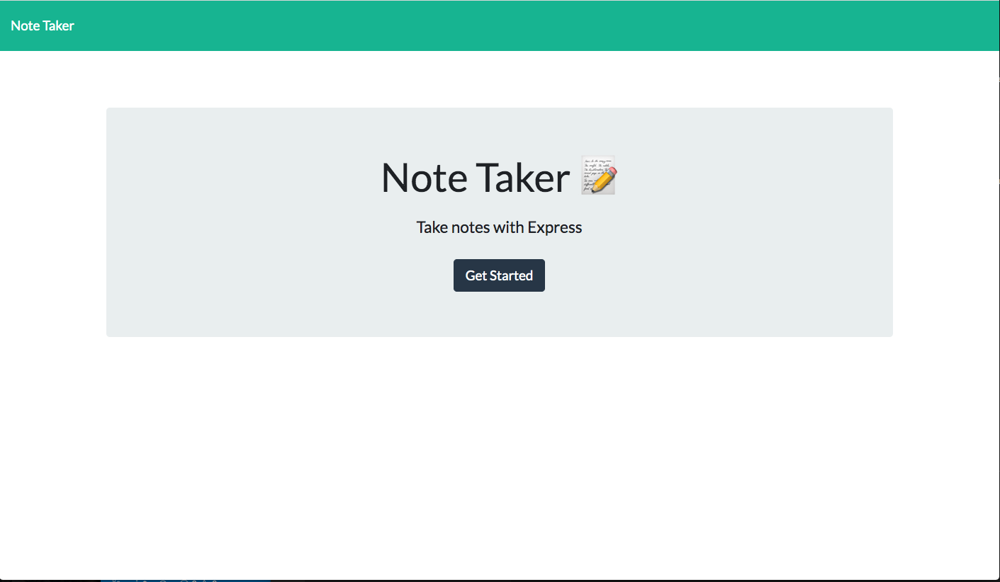

# note-taker
  

  

  ## Description
  This Project was using express.js to a create server to run the front-end starter code files. I created routes that complimented the correct methods in the starter code files. The routes I created were an app.get to tell the sever to display the static html page, app.post to create new notes and modify existing array, and app.delete to delete notes by targeting the note's property id. I used the splice() method to delete the notes array. This project was also beneficial because I became familiar with deploying my site via heroku.

  ## Table of Contents
  * [Installation](#installation)
  * [Usage](#usage)
  * [License](#license)
  * [Contributing](#contributing)
  * [Questions](#questions)

  ## installation
  Must install express.js using npm i express, and  have require('fs') to generate the files in the routes functions.

  
  ## License 
  This project is license under MIT

  ## Contributing
  The project came with a starter code. The only files that were created by the user were the server.js file, and the content inside the helpers folder

  ## Tests
  node server to start server, then Ctr C to end server. After you start the file, copy and paste the link bellow to start the application locally:
    
    http://localhost:3001
    
    

  ## Links:
  Heroku Link: https://shielded-beach-17531.herokuapp.com/

  ## Questions
  If you have any questions about this repository, please contact me via kalaitzidispaul@gmail.com. You can view more of my projects at https://github.com/paulkalait
  